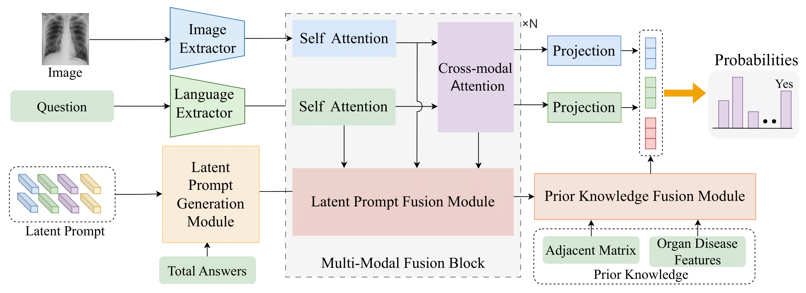

# [CVPRW 2024] LaPA: Latent Prompt Assist Model For Medical Visual Question Answering
This is the implementation of LaPA: Latent Prompt Assist Model For Medical Visual Question Answering.
## Abstract
<div  align="center">    

</div>

## Requirements
```bash
conda env create -f environment.yaml # method 1
pip install -r requirements.txt # method 2
```

## Preparation
```bash
├── checkpoints
├── data
│   ├── vqa_medvqa_2019_test.arrow
│   ├── ......
├── download
│   ├── checkpoints
│   ├── external_data
│   ├── pretrained
│   │   ├── m3ae.ckpt
│   ├── roberta-base
├── m3ae
├── prepro
├── run_scripts
```
### Dataset
1. Please follow [here](https://github.com/zhjohnchan/M3AE?tab=readme-ov-file#1-dataset-preparation-1) and only use the slake, vqa_rad and medvq_2019 datasets.

### External data
1. First download the external_data from [here](https://unisydneyedu-my.sharepoint.com/:f:/g/personal/tigu8498_uni_sydney_edu_au/Ev_GsFFY9BpKi-cOHSFIHecBRxYEB-9jjelVen4WUyyEGg?e=g3bbrC)
2. put it in the download/external_data

### Pretrained
1. First download the m3ae pretrained weight from [here](https://drive.google.com/drive/folders/1b3_kiSHH8khOQaa7pPiX_ZQnUIBxeWWn)
2. put it in the download/pretrained

### roberta-base
1. First download the roberta-base from [here](https://drive.google.com/drive/folders/1ouRx5ZAi98LuS6QyT3hHim9Uh7R1YY1H)
2. put it in the download/roberta-base

### Checkpoints
1. First download the checkpoints we trained from [here](https://unisydneyedu-my.sharepoint.com/:f:/g/personal/tigu8498_uni_sydney_edu_au/Ev_GsFFY9BpKi-cOHSFIHecBRxYEB-9jjelVen4WUyyEGg?e=g3bbrC)
2. put it in the download/checkpoints


## Train & Test

### Train
```bash
# cd this file
bash run_scripts/train.sh
```

### Test
```bash
# cd this file
bash run_scripts/test.sh
```

## Result
| Method              | Venue      | Open  | Closed | Overall | Open  | Closed | Overall | Overall |
|---------------------|------------|-------|--------|---------|-------|--------|---------|---------|
| BAN         | NeurIPS$_{18}$ | 37.40 | 72.10  | 58.30   | 74.60 | 79.10  | 76.30   | -       |
| CPRD-BAN    | MICCAI$_{21}$  | 52.50 | 77.90  | 67.80   | 79.50 | 83.40  | 80.10   | -       |
| MMBERT   | ISBI$_{21}$    | 63.10 | 77.90  | 72.00   | -     | -      | -       | 67.20   |
| M3AE$^{*}$   | MICCAI$_{22}$  | 64.80 | 82.72  | 75.61   | 79.22 | 85.10  | 81.53   | 78.40   |
| M2I2       | ISBI$_{22}$    | 61.80 | 81.60  | 73.70   | 74.70 | **91.10**  | 81.20   | -       |
| ARL$^{*}$   | MM$_{22}$      | 65.10 | 85.96  | 77.55   | 79.70 | 89.30  | 84.10   | 79.80   |
| PubMedCLIP | EACL$_{23}$ | 60.10 | 80.00  | 72.10   | 78.40 | 82.50  | 80.10   | -       |
| CPCR        | TMI$_{23}$     | 60.50 | 80.40  | 72.50   | 80.50 | 84.10  | 81.90   | -       |
| LaPA        | Ours       | **68.72** | **86.40**  | **79.38**   | **82.17** | 88.70  | **84.73**   | **81.60**   |


## Citation
If you find this project useful in your research, please cite the following papers:
```bibtex
@InProceedings{LaPA_2024_CVPRW,
    author    = {Tiancheng Gu and Kaicheng Yang and Dongnan Liu and Weidong Cai},
    title     = {LaPA: Latent Prompt Assist Model For Medical Visual Question Answering},
    booktitle = {Proceedings of the IEEE/CVF Conference on Computer Vision and Pattern Recognition (CVPR) Workshops},
    year      = {2024}
}
```

## Acknowledgement
Our project references the codes in the following repos. Thanks for their works and sharing.
* [M3AE](https://github.com/zhjohnchan/M3AE)
